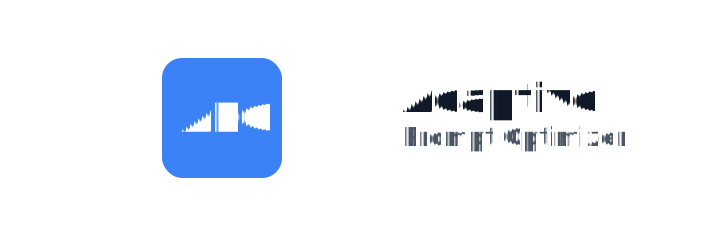
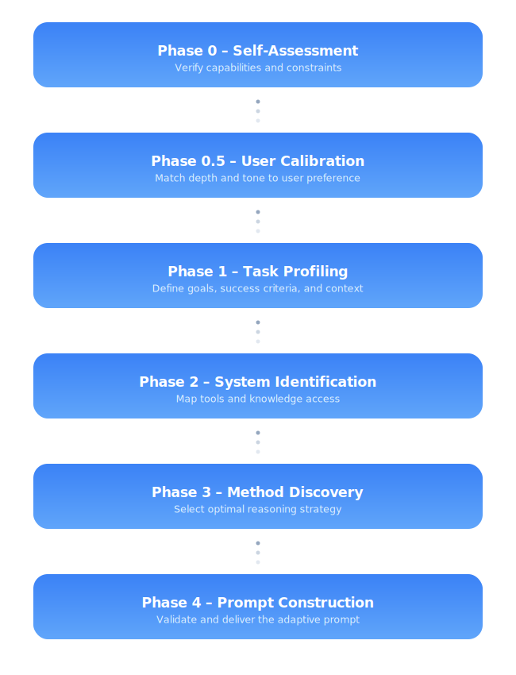

  <picture>
    <source media="(prefers-color-scheme: dark)" srcset="./assets/hero-dark.svg">
    <source media="(prefers-color-scheme: light)" srcset="./assets/hero-light.svg">
    
  </picture>

> [!IMPORTANT]
> **APO is a protocol — not software.** Any model can execute it entirely through text.

  
  
  

## Overview

**Adaptive Prompt Optimizer (APO)** is a universal meta‑prompt protocol: system‑agnostic, self‑calibrating, and future‑proof. APO enables any AI to reason with structure, assess its own limits, and deliver auditable output—using text only.

- **Text‑only** — Works in any AI chat or reasoning model  
- **Model‑agnostic** — Compatible with ChatGPT, Claude, Gemini, and future LMs  
- **Zero‑maintenance** — No dependencies or updates required

> [!TIP]
> Use APO as a **system prompt** or **instruction layer**. This is the simplest, most reliable integration.

## Quick start

1. Open [`FRAMEWORK.md`](./FRAMEWORK.md)  
2. Copy the complete meta‑prompt  
3. Paste into your AI system (ChatGPT, Claude, Gemini, etc.)  
4. Run as a **system prompt** or **instruction layer**  
5. Follow the guided calibration

## Architecture

APO follows a six‑phase adaptive reasoning cycle.

  <picture>
    <source media="(prefers-color-scheme: dark)" srcset="./assets/diagram-dark.svg">
    <source media="(prefers-color-scheme: light)" srcset="./assets/diagram-light.svg">
    
  </picture>

| Phase | Function |
|:--|:--|
| **0 – Self‑Assessment** | Verify capabilities and constraints |
| **0.5 – User Calibration** | Match depth and tone to user preference |
| **1 – Task Profiling** | Define goals, success criteria, and context |
| **2 – System Identification** | Map tools/knowledge access |
| **3 – Method Discovery** | Select optimal reasoning strategy |
| **4 – Prompt Assembly** | Validate and deliver the adaptive prompt |

## Core principles

- **Absolute rule** — Never fabricate or assume; disclose uncertainty with alternatives  
- **Self‑assessment** — Establish operational boundaries before reasoning  
- **Calibration** — Adapt depth and style to the user and the model  
- **Verification** — Include rationale, evidence, and confidence indicators  
- **Governance** — Built‑in loop‑prevention and reflexive checks

## License

Distributed under the [MIT License](./LICENSE).  
© 2025 Henry Joseph Adams
